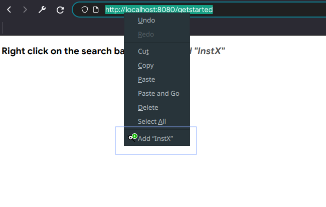

# InstX

A client-side service that automatically updates the SearX(NG) instance you use to search based on the best one from [searx.space](https://searx.space). The "best" instance is configuable based criteria such as speed, privacy, and security. It updates the instance by hosting a small web server redirects you to the "best" instance. This web server is then set as your default web browser.

## Installation

### Compiling
1. Build with `go get` and `go build`
2. Set `ExecStart` in `instx.service` to the instx binary and copy it to `~/.config/systemd/`

### Start automatically
1. `systemctl --user daemon-reload`
2. `systemctl --user enable instx`
3. `systemctl --user start instx`

### Set as the default search engine
1. Go to http://localhost:8080/getstarted
2. Right-click on the URL and click "Add InstX"

3. Set "InstX" as the default search engine in your browser

### Instxctl
InstX comes bundled with a utility called instxctl that can do things such as query instx for instance statistics, force an update of the instance list, etc.

To access instxctl simply make a copy or symbolic link of the instx binary and rename it to something that includes the string "instxctl". This new binary can now be run via the command line in instxctl mode.

## Configuration
The default config file is located at `~/.config/instx.yaml` on MacOS/Linux and `%appdata%/instx/instx.yaml` on Windows. This can be overriden by setting `$SEARX_SPACE_AUTOSELECTOR_CONFIG`.

|Required|YAML Key|Description|Go Data Type|Default Value|
|---|---|---|---|---|
|Yes|default_instance|Fallback instance|string|None|
|Yes|proxy.port|Web server port|int|8080|
|No|proxy.preferences_url|[Apply instance settings automatically](#apply-instance-settings-automatically)|string|None|
|Yes|updater.update_interval|How often all the instances are queried and analyzed (in minutes)|int64|180 (3 hours)|
|No|updater.instance_blacklist|Instances to ignore. Note that this only compares the host as defined [here](https://pkg.go.dev/net/url#URL).|[]string|None|
|Yes|updater.advanced.initial_resp_weight||float64|1.2|
|Yes|updater.advanced.search_resp_weight||float64|1.2|
|Yes|updater.advanced.google_search_resp_weight||float64|0.6|
|Yes|updater.advanced.wikipedia_search_resp_weight||float64|0.8|
|Yes|updater.advanced.outlier_multiplier||float64|2.0|
|Yes|updater.criteria.minimum_csp_grade||string|A|
|Yes|updater.criteria.minimum_tls_grade||string|A|
|Yes|updater.criteria.allowed_http_grades||[]string|[V, F, C]|
|Yes|updater.criteria.allow_analytics||bool|no|
|Yes|updater.criteria.is_onion||bool|no|
|Yes|updater.criteria.require_dnssec||bool|no|
|Yes|updater.criteria.searxng_preference||string|required|

### Tuning

#### Response weights
Applies to the following YAML keys
* `updater.advanced.initial_resp_weight`
* `updater.advanced.search_resp_weight`
* `updater.advanced.google_search_resp_weight`
* `updater.advanced.wikipedia_search_resp_weight`

The response weights control how important the response time when judging each instance
* **Initial:** Initial response time of the instance
* **Search:** Response time for all search results
* **Google:** Response time from Google
* **Wikipedia:** Response time from Wikipedia

Each setting is a float value _n_ where _0 < n < 2_. Values greater than 1 give more importance to the scenario while values less than 1 give less importance. _n = 1_ nullifies the weight.

#### Outlier Multiplier
Applies to `updater.advanced.outlier_multiplier`.

A float value _n_ where _0 < n < 2_. Higher outlier multiplier values lower the threshold at which a response time is considered an outlier.

#### SearX.space instance criteria
Applies to everything under `updater.criteria`

`updater.criteria.minimum_csp_grade` and `updater.criteria.minimum_csp_grade` accept letter grades **A+, A, A-, B+, B, B-, C+, C, C-, D+, D, D-, F**. The two grades are the minimum grade the instance needs from [dalf/http-observatory](https://github.com/dalf/http-observatory) and [cryptcheck.fr](https://cryptcheck.fr/) respectively.

`updater.criteria.allowed_http_grades` is an array of the allowed [searx.space](https://searx.space#help-http-grade) Instance grades. **NOTE: "Cjs" doesn't seem to parse properly at the moment.**

`updater.criteria.searxng_preference` accepts three values - required, forbidden, impartial - and dictates how SearXNG instances should be treated.
* **required:** filters out any non-SearXNG instances 
* **forbidden:** filters out any SeaXNG instances 
* **impartial:** no preference

## Apply instance settings automatically

Grab the saved preferences url at https://favorite.instance/preferences and paste it in `instx.yaml` in `preferences_url`. No need to cut out the original domain name or any other GET parameters.

